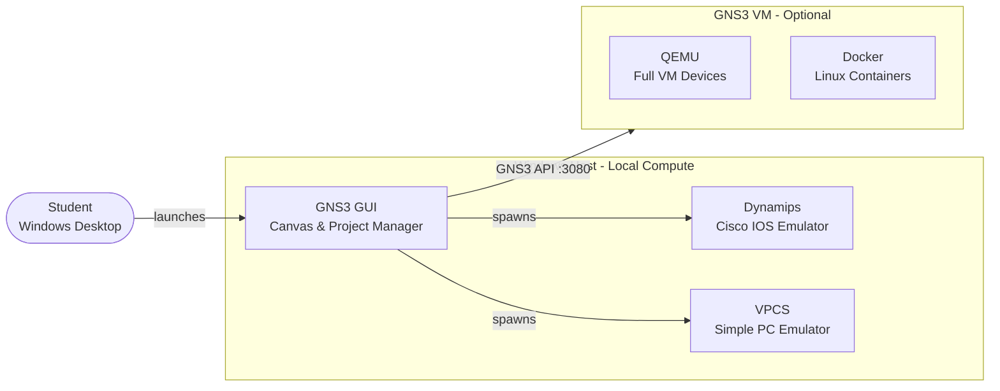
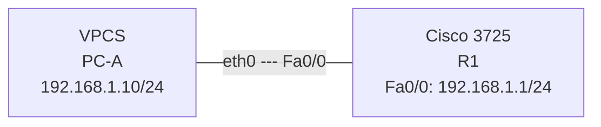

# GNS3 Architecture

## How GNS3 Works

GNS3 splits into two logical layers: a **frontend** (the GUI you interact with) and one or more **compute backends** that actually run device processes. Understanding this split explains why some devices can run on your Windows desktop while others need the GNS3 VM.

| Component | What It Does | Runs On |
|-----------|-------------|---------|
| **GNS3 GUI** | Draws the canvas, manages projects, opens consoles | Windows host |
| **Dynamips** | Emulates Cisco hardware for IOS images (3725, 3640, etc.) | Windows host |
| **VPCS** | Minimal PC with IP stack — supports `ping`, `trace`, static routes | Windows host |
| **GNS3 VM** | Full Linux VM hosting QEMU and Docker; required for newer platforms | VMware / VirtualBox |
| **QEMU** | Hypervisor for IOS-XE, IOS-XR, ASA, vEOS, etc. | Inside GNS3 VM |
| **Docker** | Container engine for Linux-based appliances | Inside GNS3 VM |

---

## Which Devices Need the GNS3 VM?

| Device | Engine | Needs GNS3 VM? |
|--------|--------|----------------|
| Cisco 3725 (IOS 12.4) | Dynamips | No - runs locally on Windows |
| Cisco 3640, 3660, 7200 | Dynamips | No - runs locally on Windows |
| VPCS | Built-in | No - runs locally on Windows |
| Built-in Ethernet Switch / Hub | Built-in | No - runs locally on Windows |
| Cisco CSR1000v (IOS-XE) | QEMU | Yes |
| Cisco IOSv / IOSvL2 | QEMU | Yes |
| Cisco ASAv | QEMU | Yes |
| Arista vEOS | QEMU | Yes |
| Linux containers (Alpine, Ubuntu) | Docker | Yes |

!!! info "For this lab series"
    All labs use the **Cisco 3725 with Dynamips** and **VPCS**. The GNS3 VM is **not required**. Everything runs directly on your Windows desktop.

---

## Session 1 Target Topology

By the end of this session your GNS3 canvas will look like this:

This single-router, single-PC topology is the minimum needed to confirm that GNS3 is working correctly. Sessions 2 and beyond build on this foundation with more complex switching and routing topologies.
