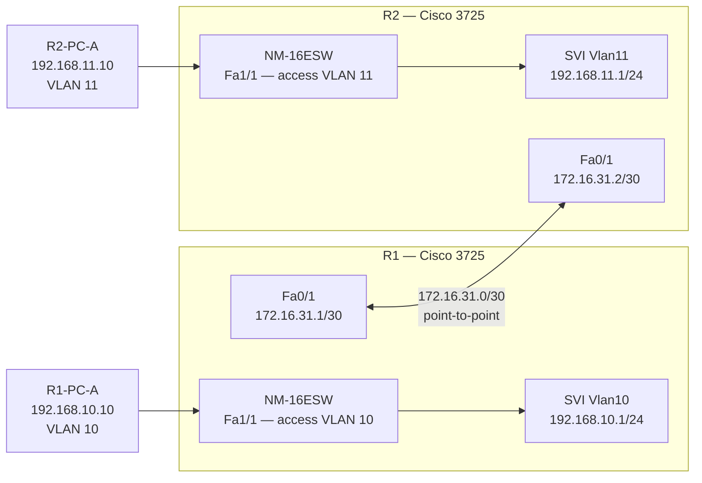

# Topology

```
                    172.16.31.x/30
                   (student selected)

  [R1-PC-A]                                    [R2-PC-A]
 VLAN 10                                          VLAN 11
192.168.10.10                                  192.168.11.10
      |                                               |
  Fa1/1 (access)                             Fa1/1 (access)
      |                                               |
   NM-16ESW                                      NM-16ESW
   SVI Vlan10                                    SVI Vlan11
 (192.168.10.1)                              (192.168.11.1)
      |                                               |
   R1 Fa0/1 ──────────────────────────────── Fa0/1 R2
     172.16.31.1/30                   172.16.31.2/30
                    (point-to-point /30 link)
```



R1 and R2 are each a Cisco 3725 with an NM-16ESW switching module. Each router provides a default gateway for its local VLAN via an SVI (`interface Vlan10` on R1, `interface Vlan11` on R2). The two routers connect directly via `Fa0/1` using a `/30` point-to-point subnet chosen from the addressing table.

---

## Link Table

| Link | Device A | Interface A | Device B | Interface B | Type |
|------|----------|-------------|----------|-------------|------|
| 1 | R1 | Fa1/1 | R1-PC-A | NIC | Access — VLAN 10 |
| 2 | R2 | Fa1/1 | R2-PC-A | NIC | Access — VLAN 11 |
| 3 | R1 | Fa0/1 | R2 | Fa0/1 | Point-to-point routed link (/30) |

> [!NOTE]
> With SVIs, no trunk link between the NM-16ESW and the router's `Fa0/0` port is required. The SVI (`interface Vlan10`, `interface Vlan11`) is a logical interface on the 3725 that binds directly to the VLAN on the NM-16ESW. The router's `Fa0/0` port is not used in this session — the WAN link uses `Fa0/1`.

---

## Device Summary

| Device | Role | Notes |
|--------|------|-------|
| R1 | Router + switch for VLAN 10 LAN | NM-16ESW hosts VLAN 10; SVI Vlan10 (192.168.10.1) for routing; Fa0/1 for WAN link |
| R2 | Router + switch for VLAN 11 LAN | NM-16ESW hosts VLAN 11; SVI Vlan11 (192.168.11.1) for routing; Fa0/1 for WAN link |
| R1-PC-A | VLAN 10 host | Simulated with VPCS or loopback |
| R2-PC-A | VLAN 11 host | Simulated with VPCS or loopback |
