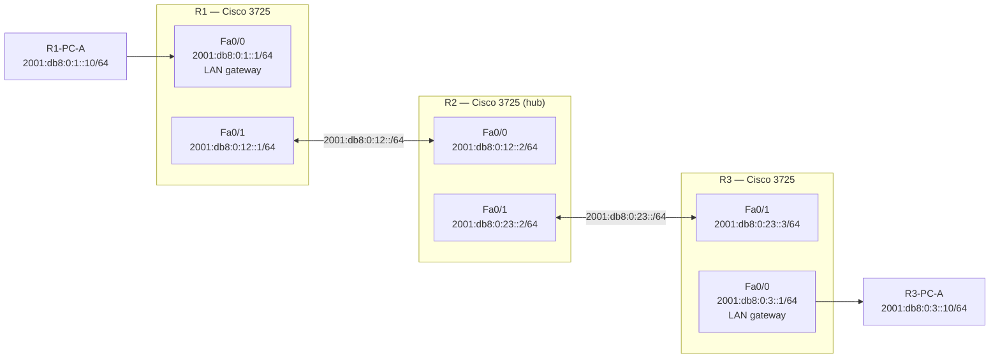

# Topology

R1 and R3 each serve a local LAN segment via `Fa0/0`. R2 is the hub router connecting both sites via `Fa0/0` (toward R1) and `Fa0/1` (toward R3). No NM-16ESW module is used — PCs connect directly to the router's built-in FastEthernet port.

---

## Link Table

| Link | Device A | Interface A | Device B | Interface B | Type |
|------|----------|-------------|----------|-------------|------|
| 1 | R1 | Fa0/0 | R1-PC-A | NIC | LAN — R1 site |
| 2 | R1 | Fa0/1 | R2 | Fa0/0 | Point-to-point routed link |
| 3 | R2 | Fa0/1 | R3 | Fa0/1 | Point-to-point routed link |
| 4 | R3 | Fa0/0 | R3-PC-A | NIC | LAN — R3 site |

---

## Device Summary

| Device | Role | Interfaces Used |
|--------|------|-----------------|
| R1 | Left spoke router | Fa0/0 — LAN gateway; Fa0/1 — WAN to R2 |
| R2 | Hub router | Fa0/0 — WAN to R1; Fa0/1 — WAN to R3 |
| R3 | Right spoke router | Fa0/0 — LAN gateway; Fa0/1 — WAN to R2 |
| R1-PC-A | IPv6 host on R1 LAN | Simulated with VPCS or loopback |
| R3-PC-A | IPv6 host on R3 LAN | Simulated with VPCS or loopback |
