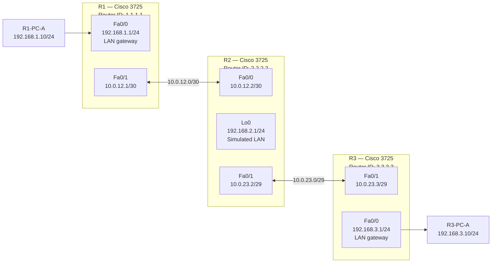

# Topology

R1 and R3 each serve a local LAN segment via `Fa0/0`, with PCs connecting directly to the router interface. R2 is the transit router — it has no physical LAN; instead, a `Loopback0` interface simulates a connected network that OSPF and EIGRP will advertise. The R1–R2 WAN link uses a `/30` subnet; the R2–R3 WAN link uses a `/29` subnet so that `.2` (R2) and `.3` (R3) are both valid host addresses.

---

## Link Table

| Link | Device A | Interface A | Device B | Interface B | Subnet |
|------|----------|-------------|----------|-------------|--------|
| 1 | R1 | Fa0/0 | R1-PC-A | NIC | 192.168.1.0/24 |
| 2 | R1 | Fa0/1 | R2 | Fa0/0 | 10.0.12.0/30 |
| 3 | R2 | Fa0/1 | R3 | Fa0/1 | 10.0.23.0/29 |
| 4 | R3 | Fa0/0 | R3-PC-A | NIC | 192.168.3.0/24 |

---

## Device Summary

| Device | Role | Interfaces Used |
|--------|------|-----------------|
| R1 | Left router | Fa0/0 — LAN gateway; Fa0/1 — WAN to R2 |
| R2 | Transit router | Fa0/0 — WAN to R1; Fa0/1 — WAN to R3; Lo0 — simulated LAN |
| R3 | Right router | Fa0/0 — LAN gateway; Fa0/1 — WAN to R2 |
| R1-PC-A | End host on R1 LAN | Simulated with VPCS or loopback |
| R3-PC-A | End host on R3 LAN | Simulated with VPCS or loopback |
