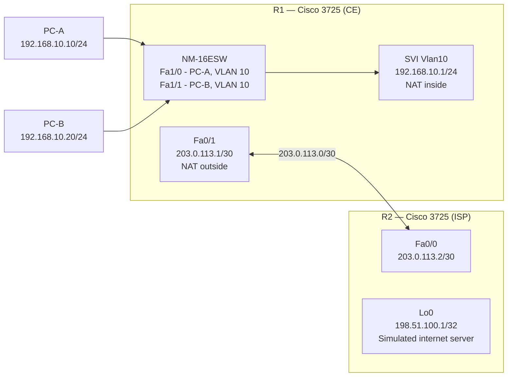

# Topology

R1 acts as a customer-edge (CE) router: its NM-16ESW module provides a switched LAN for the two clients on VLAN 10, and its built-in `Fa0/1` connects to R2 over a simulated public WAN link. R2 represents an ISP router — it has no route back to `192.168.10.0/24`, which is the correct behavior for internet infrastructure that has never seen RFC1918 prefixes. A loopback on R2 (`198.51.100.1`) serves as a reachable internet destination for testing.

---

## Link Table

| Link | Device A | Interface A | Device B | Interface B | Subnet |
|------|----------|-------------|----------|-------------|--------|
| 1 | R1 | Fa1/0 | PC-A | NIC | 192.168.10.0/24 (VLAN 10) |
| 2 | R1 | Fa1/1 | PC-B | NIC | 192.168.10.0/24 (VLAN 10) |
| 3 | R1 | Fa0/1 | R2 | Fa0/0 | 203.0.113.0/30 |

> [!NOTE]
> Both PC-A and PC-B are on the same VLAN 10 subnet. The NM-16ESW switches their traffic locally; R1's SVI (`interface Vlan10`) serves as the default gateway for both. No trunk link between the NM-16ESW and R1's `Fa0/0` is needed — the SVI binds directly to the VLAN on the switching module.

---

## Device Summary

| Device | Role | Interfaces Used |
|--------|------|-----------------|
| R1 | CE router — NAT, ACL enforcement | Fa1/0 and Fa1/1 — access VLAN 10; SVI Vlan10 — inside NAT; Fa0/1 — outside NAT |
| R2 | ISP simulation | Fa0/0 — WAN facing R1; Lo0 — internet server destination |
| PC-A | Inside host, initially in NAT permit list | VPCS on Fa1/0 |
| PC-B | Inside host, initially excluded from NAT | VPCS on Fa1/1 |

---

## Address Space Notes

The WAN subnet `203.0.113.0/30` is drawn from the IANA TEST-NET-3 range (`203.0.113.0/24`), reserved for use in documentation and lab scenarios. It is not routable on the public internet but is deliberately non-RFC1918 to simulate the appearance of a real ISP-assigned address. Similarly, `198.51.100.0/24` (TEST-NET-2) is used for R2's loopback. Neither range will conflict with real infrastructure.
