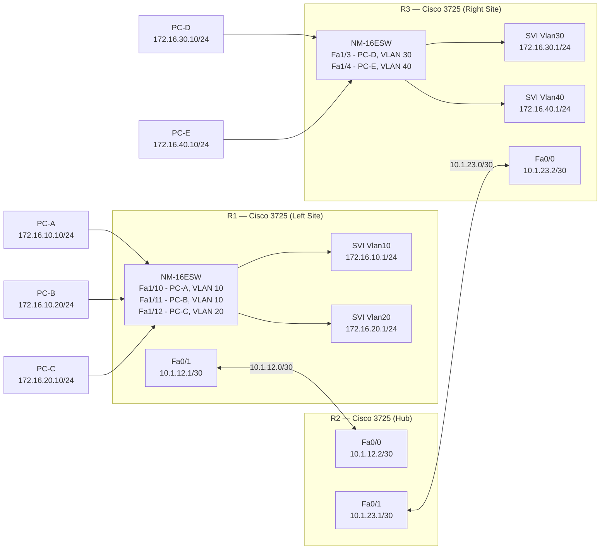

# Topology

R1 serves the left site with two VLANs — VLAN 10 (Sales, two hosts) and VLAN 20 (Management, one host). R3 mirrors this structure on the right site with VLAN 30 (Sales) and VLAN 40 (Management). R2 is a pure Layer 3 hub with no switching module; it connects the two sites over /30 WAN links and runs OSPF with both neighbors. All three routers participate in OSPF area 0.

---

## Link Table

| Link | Device A | Interface A | Device B | Interface B | Subnet |
|------|----------|-------------|----------|-------------|--------|
| 1 | R1 | Fa1/10 | PC-A | NIC | 172.16.10.0/24 (VLAN 10) |
| 2 | R1 | Fa1/11 | PC-B | NIC | 172.16.10.0/24 (VLAN 10) |
| 3 | R1 | Fa1/12 | PC-C | NIC | 172.16.20.0/24 (VLAN 20) |
| 4 | R1 | Fa0/1 | R2 | Fa0/0 | 10.1.12.0/30 |
| 5 | R2 | Fa0/1 | R3 | Fa0/0 | 10.1.23.0/30 |
| 6 | R3 | Fa1/3 | PC-D | NIC | 172.16.30.0/24 (VLAN 30) |
| 7 | R3 | Fa1/4 | PC-E | NIC | 172.16.40.0/24 (VLAN 40) |

> [!NOTE]
> R1 and R3 use SVIs for inter-VLAN routing — there is no trunk link between the NM-16ESW and the router chassis. The SVI (`interface Vlan10`, etc.) binds directly to the VLAN on the switching module. No subinterfaces or router-on-a-stick configuration is used.

---

## Device Summary

| Device | Role | Interfaces Used |
|--------|------|-----------------|
| R1 | Left-site router — VLAN 10 and VLAN 20 | Fa1/10, Fa1/11 (VLAN 10 access); Fa1/12 (VLAN 20 access); Fa0/1 (WAN to R2) |
| R2 | Hub router — OSPF, ACL enforcement | Fa0/0 (WAN to R1); Fa0/1 (WAN to R3) |
| R3 | Right-site router — VLAN 30 and VLAN 40 | Fa1/3 (VLAN 30 access); Fa1/4 (VLAN 40 access); Fa0/0 (WAN to R2) |
| PC-A | Left-site Sales host | VPCS on R1 Fa1/10 |
| PC-B | Left-site Sales host | VPCS on R1 Fa1/11 |
| PC-C | Left-site Management host | VPCS on R1 Fa1/12 |
| PC-D | Right-site Sales host | VPCS on R3 Fa1/3 |
| PC-E | Right-site Management host | VPCS on R3 Fa1/4 |
